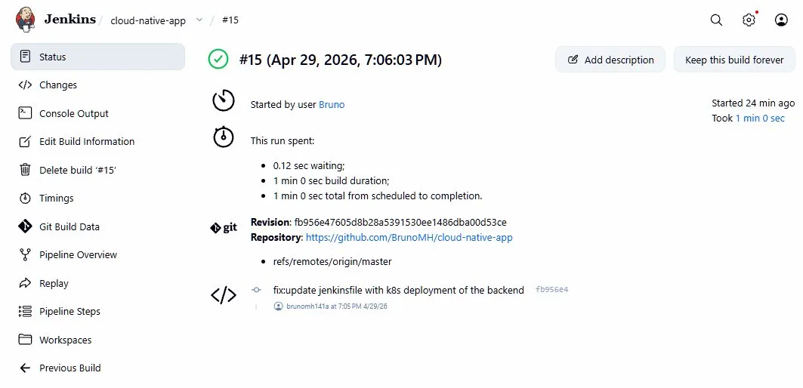
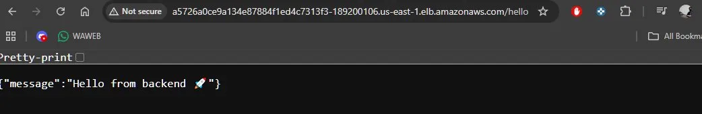

# Cloud Native App — End to End DevOps Project

A full end-to-end DevOps project built from scratch. A Node.js API dockerized, deployed on Kubernetes in AWS, with a fully automated CI/CD pipeline using Jenkins, Terraform, and ECR.

---

## Architecture

```
Developer
    │
    │  git push
    ▼
GitHub (cloud-native-app)
    │
    │  webhook
    ▼
Jenkins (CI/CD pipeline)
    ├── Stage 1: Build Docker image
    ├── Stage 2: Push to ECR (AWS registry)
    └── Stage 3: Deploy to EKS
            │
            ▼
        AWS Infrastructure (Terraform)
        ├── VPC + subnets
        ├── ECR — Docker registry
        └── EKS — Kubernetes cluster
                ├── Pod 1 (backend)
                ├── Pod 2 (backend)
                └── Load Balancer → public URL
```

---

## Tech Stack

| Layer | Technology |
|---|---|
| App | Node.js + Express |
| Containerization | Docker |
| Container Registry | AWS ECR |
| Orchestration | Kubernetes (AWS EKS) |
| CI/CD | Jenkins |
| Infrastructure as Code | Terraform |
| Cloud | AWS (VPC, EKS, ECR) |
| Version Control | GitHub |

---

## Project Structure

```
project/
├── backend/              # Node.js API
│   ├── index.js
│   ├── package.json
│   └── Dockerfile
├── k8s/                  # Kubernetes manifests
│   ├── deployment.yaml
│   └── service.yaml
├── terraform/            # AWS infrastructure
│   ├── main.tf           # VPC + EKS + ECR
│   ├── variables.tf
│   ├── outputs.tf
│   └── terraform.tfvars
├── Dockerfile.jenkins    # Custom Jenkins image
└── Jenkinsfile           # CI/CD pipeline
```

---

## Phases

### Phase 1 — Local Kubernetes
- Node.js backend with `/hello` endpoint
- Dockerized with a multi-stage Dockerfile
- Deployed locally with Minikube

### Phase 2 — CI/CD with Jenkins
- Custom Jenkins image with Docker CLI and kubectl
- Pipeline: build → deploy to local Kubernetes
- Jenkinsfile read from GitHub automatically

### Phase 3 — AWS Infrastructure with Terraform
- VPC with public and private subnets across 2 availability zones
- NAT Gateway for outbound traffic from private subnets
- EKS cluster (Kubernetes 1.32) with managed node group
- ECR repository for Docker images

### Phase 4 — Deploy to EKS
- Image pushed to ECR
- kubectl connected to EKS via AWS CLI
- App running on real AWS infrastructure

### Phase 5 — Full CI/CD Pipeline
- Jenkins detects push to GitHub via webhook
- Builds Docker image with build number as tag
- Pushes image to ECR automatically
- Updates EKS deployment with the new image
- App live on public URL via AWS Load Balancer

---

## Pipeline

```groovy
pipeline {
  stages {
    stage('Build')        // docker build
    stage('Push to ECR')  // docker push to AWS
    stage('Deploy to EKS') // kubectl apply + set image
  }
}
```

---

## How to Run

### Prerequisites
- AWS CLI configured (`aws configure`)
- Terraform >= 1.5
- Docker Desktop
- kubectl

### 1. Create infrastructure
```bash
cd terraform
terraform init
terraform apply
```

### 2. Connect kubectl to EKS
```bash
aws eks update-kubeconfig --region us-east-1 --name cloud-native-cluster
```

### 3. Run Jenkins pipeline
Push to GitHub — Jenkins automatically builds, pushes to ECR, and deploys to EKS.

### 4. Destroy infrastructure
```bash
kubectl delete -f k8s/
terraform destroy
```

---

## Screenshots

### Architecture (PLAN)


### Jenkins pipeline — build #15 (SUCCESS)


### API responding from AWS


---

## Key Learnings

- Infrastructure as Code with Terraform — reproducible environments with a single command
- EKS managed Kubernetes — no manual cluster management
- ECR private registry — secure image storage and versioning per build
- IAM permissions — granular access control for CI/CD automation
- Rolling deployments — zero downtime updates with `kubectl set image`

---

## Author

Bruno — [@BrunoMH](https://github.com/BrunoMH)